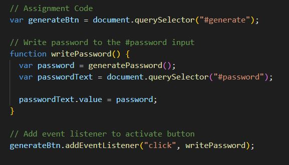
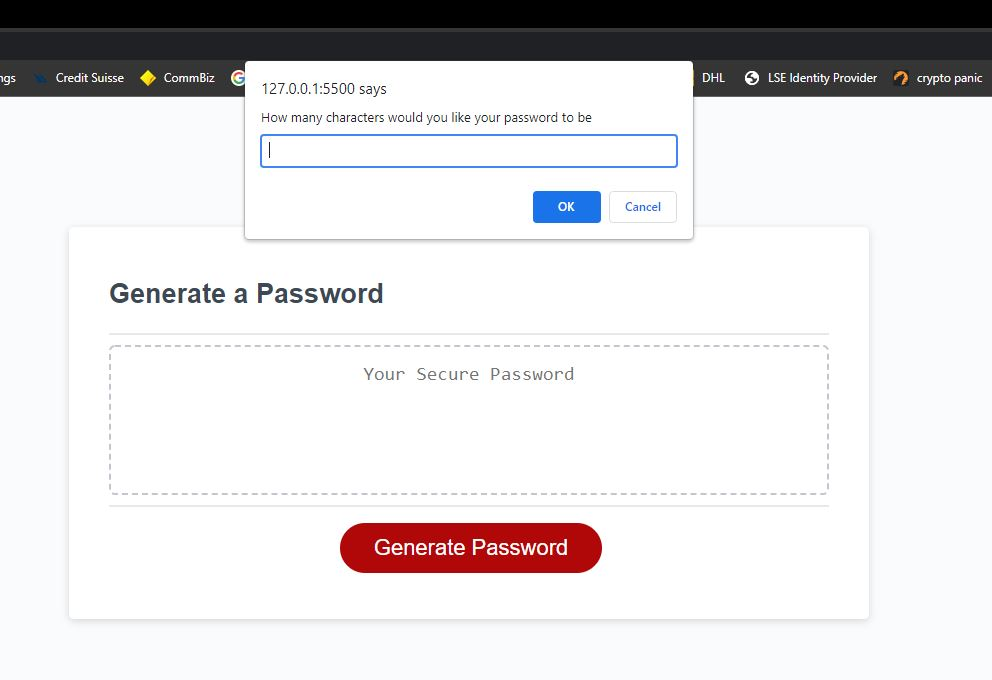
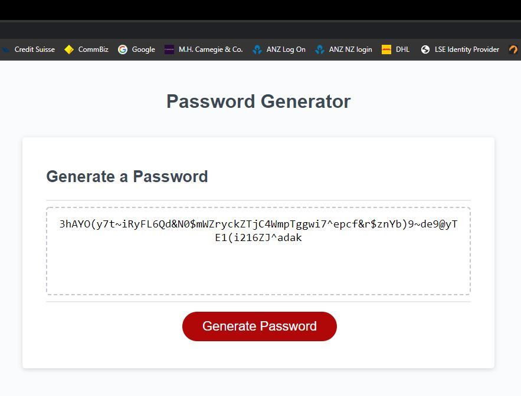

# Ticket #0003 - Password Generator
 
A client has come to me seeking a random password generator for greater security and confidentiality within his office. Some starter code had already been provided within Javascript and has been requested to modifiy to meet certain criteria which has been entered in by the user.

## Installation
The initial code provided as seen here.

I needed to create a number of Arrays with various characters to be used as options for the password generator and then use the console log and for loop functions to concatenate these arrays and move them into the password generater based on the users input. 

## Usage 
I also created a window prompt to allow customisation by the user depending on their needs. This included: how many characters would like your password to be, would you like any uppercase/lower case letters as well as any special case characters. See example below.

## Links
https://github.com/xCaitx/Password-Generator-

## Results
The final outcome should look like this.

## Credits
N/A
